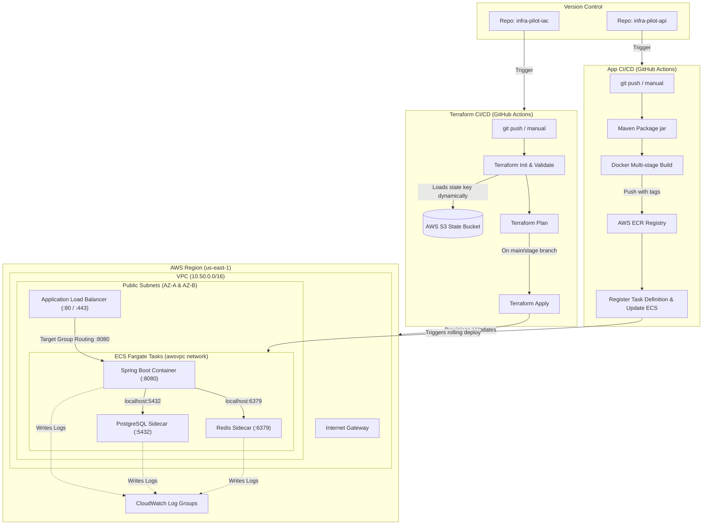

# InfraPilot - Infrastructure as Code (IaC) Workspace

Welcome to the central infrastructure repository for the **InfraPilot** platform. This repository contains the complete Terraform configuration and automated GitHub Actions CI/CD pipelines to build, manage, and scale a multi-container AWS ECS Fargate environment (including Spring Boot API, PostgreSQL, and Redis sidecars) across staging and production.

---

## 1. Architectural Map

The diagram below details the end-to-end GitOps flow, showing how commits trigger infrastructure changes or application deployments, and how Fargate container tasks share a local network loopback interface to run database and caching sidecars for zero hosting costs.



---

## 2. Infrastructure Components Matrix

Here is what this Terraform code provisions and manages in your AWS account:

| Component | Resource Type | Description / Configuration |
| :--- | :--- | :--- |
| **VPC** | `aws_vpc` | Isolated virtual network block (`10.50.0.0/16`) for network boundaries. |
| **Public Subnets** | `aws_subnet` | Dual subnets spanning two Availability Zones (`us-east-1a`, `us-east-1b`) for high-availability routing. |
| **IGW & Routes** | `aws_internet_gateway` | Enables incoming load balancer traffic and outgoing container pulls. |
| **Security Groups** | `aws_security_group` | Stateful firewalls. ALB allows port 80/443; ECS task only allows port 8080 from the ALB. |
| **Load Balancer** | `aws_lb` | Application Load Balancer (ALB) acting as the public entry point for client HTTP requests. |
| **Target Group** | `aws_lb_target_group` | Routes traffic to container port 8080 with Actuator readiness health checks. |
| **ECS Cluster** | `aws_ecs_cluster` | Logical grouping for Fargate task container orchestration. |
| **ECR Registry** | `aws_ecr_repository` | Private Docker registries isolated per environment (`infrapilot-stage` and `infrapilot-prod`). |
| **Task Definition** | `aws_ecs_task_definition` | The blueprint defining the 3-container pod (API, Postgres 16, and Redis 7.4). |
| **ECS Service** | `aws_ecs_service` | Orchestrates running instances. Ignores task definition changes to support app-only deployments. |

---

## 3. How to Use & Operate the IaC Repository

The pipeline is fully automated but supports manual operations for safety and environment control.

### Setup GitHub Actions (First-time Config)
Add the following **Repository Secrets** under **Settings** -> **Secrets and variables** -> **Actions**:
* `AWS_ACCESS_KEY_ID`: Your AWS Access Key ID.
* `AWS_SECRET_ACCESS_KEY`: Your AWS Secret Access Key.

Add the following **Repository Variable**:
* `AWS_REGION`: The target AWS region (e.g., `us-east-1`).

---

### Manual Pipeline Trigger (`workflow_dispatch`)
You can dry-run plans, apply changes, or destroy resources manually:
1. Go to your repository on GitHub and click the **Actions** tab.
2. Select the **Terraform CI/CD** workflow.
3. Click the **Run workflow** dropdown on the right.
4. Select the options:
   * **Target environment**: `stage` or `prod`.
   * **Terraform action**: `plan` (dry-run review), `apply` (deploy updates), or `destroy` (tear down).

---

### How to Modify and Update Infrastructure
Follow these steps to update infrastructure variables or resource sizes:
1. **Create a local branch**:
   ```bash
   git checkout -b feature/increase-ecs-size
   ```
2. **Modify the code**: Edit [variables.tf](file:///c:/Users/ASUS/Desktop/Sumit/vscode/infra-pilot-iac/variables.tf) (e.g., increase `task_cpu` to `2048` or `task_memory` to `4096`).
3. **Commit & Push**:
   ```bash
   git add variables.tf
   git commit -m "feat: scale up ECS task size configuration"
   git push -u origin feature/increase-ecs-size
   ```
4. **Open a PR**: Open a PR on GitHub targeting the **`stage`** branch. The PR validation pipeline will automatically run a dry-run check (`terraform plan`) so you can verify the changes.
5. **Merge PR**: Once merged, the pipeline runs `terraform apply -auto-approve` to update the Staging environment automatically.
6. **Deploy to Production**: To deploy to Production, merge the `stage` branch into the **`main`** branch.

---

## 4. SRE Debugging Playbook

Here are the essential AWS CLI commands for debugging and troubleshooting the live infrastructure.

### Scenario A: ECS Tasks Keep Crashing (Exit Code 1 / CrashLoop)
If your tasks are entering a boot-loop, list the stopped tasks to find the reason:
```bash
# 1. List recently stopped tasks in the cluster
aws ecs list-tasks --cluster infrapilot-stage --status STOPPED --region us-east-1

# 2. Get the stopped reason (e.g., container check failure, out of memory, credentials fail)
aws ecs describe-tasks \
  --cluster infrapilot-stage \
  --tasks <STOPPED_TASK_ID> \
  --query "tasks[0].stoppedReason" \
  --region us-east-1
```
* **Common Cause**: Check CloudWatch Logs. If Spring Boot fails to start, it is usually because it cannot reach PostgreSQL or Redis on `localhost` (e.g. database credentials or sidecar startup failure).

---

### Scenario B: Inspecting Container Logs on CloudWatch
To view the output console of your containers directly from the CLI:
```bash
# 1. Fetch the last 50 logs from the application container
aws logs get-log-events \
  --log-group-name "/ecs/infrapilot-stage" \
  --log-stream-name "app/infrapilot/<TASK_ID>" \
  --limit 50 \
  --region us-east-1

# 2. Fetch logs from the PostgreSQL sidecar container
aws logs get-log-events \
  --log-group-name "/ecs/infrapilot-stage" \
  --log-stream-name "postgres/postgres/<TASK_ID>" \
  --limit 50 \
  --region us-east-1
```

---

### Scenario C: ALB Health Check Failures
If the ALB target group marks the container as unhealthy:
1. **Spring Boot slow startup**: Check if Spring Boot takes longer than 120 seconds to boot up. If yes, increase `health_check_grace_period_seconds` in `ecs.tf`.
2. **Readiness endpoint failure**: Query the health check path manually from a container shell or verify logs:
   ```bash
   # Enter the container shell to query localhost
   aws ecs execute-command --cluster infrapilot-stage \
     --task <TASK_ID> \
     --container infrapilot \
     --interactive \
     --command "/bin/sh"
     
   # Test readiness
   curl -i http://localhost:8080/actuator/health/readiness
   ```

---

## 5. Current System Problems & Future Cloud-Native Upgrades

While the current architecture (ECS Fargate + Local sidecars) is cost-efficient and excellent for education, it has trade-offs that make it unsuitable for high-load production environments. Below is how other cloud-native technologies solve these limitations:

```
┌──────────────────────────────────────────┐      Upgrade      ┌──────────────────────────────────────────┐
│           CURRENT ARCHITECTURE           │ ────────────────► │        FUTURE CLOUD-NATIVE STACK         │
│  - Ephemeral Sidecars (Storage loss)     │                   │  - AWS RDS Postgres (Persistent Storage)  │
│  - ECS Fargate (Manual scheduling)       │                   │  - AWS EKS / Kubernetes (Auto-healing)   │
│  - Local state in S3 (No sync limits)    │                   │  - GitOps / ArgoCD (Drift Prevention)    │
└──────────────────────────────────────────┘                   └──────────────────────────────────────────┘
```

### Problem 1: Ephemeral Storage (Database data loss)
* **Current Issue**: Because PostgreSQL runs as a sidecar inside the Fargate task, the database storage is ephemeral. If the Fargate task restarts (e.g., during deployments, scaling, or host failures), **all database records are permanently deleted**.
* **Future Upgrade (AWS RDS)**: Separate the database layer. Spin up an **AWS RDS PostgreSQL** instance. RDS stores data on persistent, replicated EBS volumes, performs automatic snapshots, and supports multi-AZ failover.

### Problem 2: Single Point of Failure & Scaling Limits
* **Current Issue**: Running Postgres and Redis as sidecars inside the Fargate task means every task replica runs its own database. You cannot scale out to `desired_count = 2` without creating two independent, unsynced databases!
* **Future Upgrade (AWS EKS & Managed Services)**: Migrate container orchestration to **Kubernetes (AWS EKS)**. EKS allows you to decouple services cleanly. The app container runs as a Kubernetes Deployment, scaled horizontally across nodes, connecting to centralized, shared managed services (AWS RDS for Postgres and AWS ElastiCache for Redis).

### Problem 3: Configuration Drift & GitOps Control
* **Current Issue**: ECS Fargate service configurations can be modified out-of-band via the AWS Console, causing "configuration drift" where the live infrastructure doesn't match the HCL files.
* **Future Upgrade (ArgoCD / OpenTofu)**: Implement **ArgoCD** (for Kubernetes) or **Terraform Cloud Drift Control**. ArgoCD constantly monitors the live cluster status against your Git repository. If anyone manually changes a setting in the console, ArgoCD automatically overwrites and syncs it back to match the Git configuration, enforcing Git as the single source of truth.

---

## 6. Multi-Cloud Migration Strategy

Terraform makes it simple to migrate your workload to other cloud providers. Below is how the AWS components map to Google Cloud (GCP) and Microsoft Azure:

| AWS Component | Google Cloud (GCP) Mapping | Azure Mapping |
| :--- | :--- | :--- |
| **VPC & Subnets** | VPC Network & Subnets | Azure Virtual Network (VNet) |
| **ECR Registry** | Artifact Registry | Azure Container Registry (ACR) |
| **ECS Fargate** | Cloud Run (Serverless Container Platform) | Azure Container Apps (ACA) |
| **Application Load Balancer** | GCP HTTPS Load Balancer | Azure Application Gateway |
| **CloudWatch Logs** | Cloud Logging & Monitoring | Azure Monitor / Log Analytics |

### Switching Cloud Providers in Terraform
To migrate this stack to Google Cloud (GCP) using Terraform:
1. Replace the provider declaration in `main.tf` with the Google provider:
   ```terraform
   provider "google" {
     project = "your-gcp-project-id"
     region  = "us-central1"
   }
   ```
2. Rewrite resource blocks using the GCP equivalent modules (e.g., change `aws_vpc` to `google_compute_network`, and `aws_ecs_service` to `google_cloud_run_v2_service`).
3. Google Cloud Run automatically handles serverless container execution and load balancing out-of-the-box, allowing you to migrate your multi-container Docker setup with minimal network configuration.
