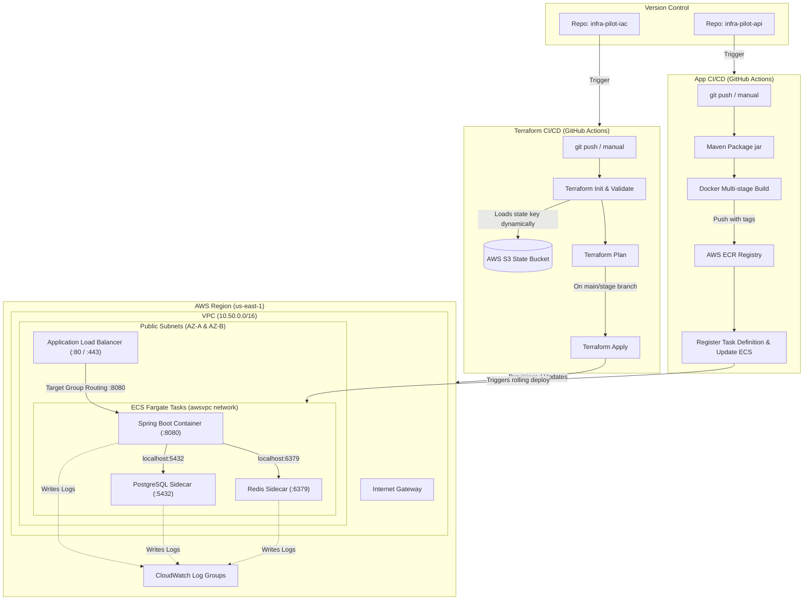
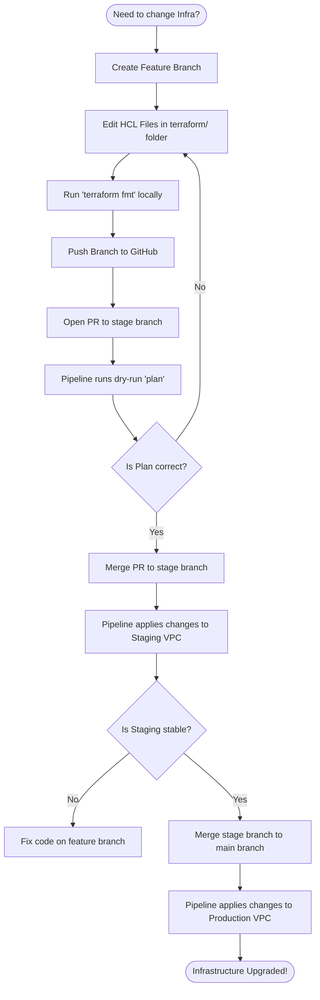
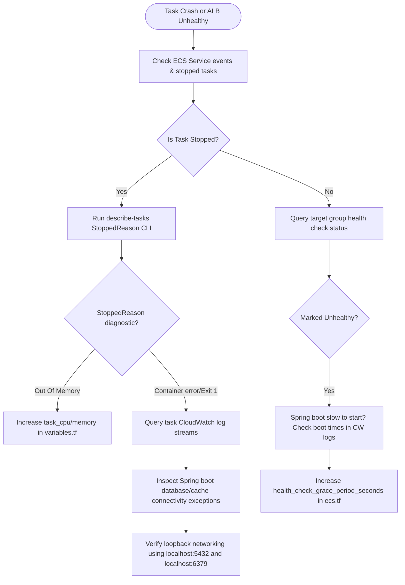

# InfraPilot - Infrastructure as Code (IaC) Workspace

Welcome to the central infrastructure repository for the **InfraPilot** platform. This repository contains the complete Terraform configuration and automated GitHub Actions CI/CD pipelines to build, manage, and scale a multi-container AWS ECS Fargate environment (including Spring Boot API, PostgreSQL, and Redis sidecars) across staging and production.

---

## 1. Architectural Map

The diagram below details the end-to-end GitOps flow, showing how commits trigger infrastructure changes or application deployments, and how Fargate container tasks share a local network loopback interface to run database and caching sidecars for zero hosting costs.



---

## 2. Directory Layout & Organization

The repository has been structured cleanly to separate pipeline configuration from infrastructure blueprints. Changes to documentation files (like `README.md`) will **not** trigger any CI/CD runs. Only changes made within the `terraform/` directory will initiate the pipelines.

```
infra-pilot-iac/
├── .github/
│   └── workflows/
│       └── terraform-ci-cd.yml   # CI/CD pipeline definition
├── terraform/                    # All Terraform HCL code resides here
│   ├── main.tf                   # Provider setup & S3 backend
│   ├── variables.tf              # Input parameters (port, sizes, etc.)
│   ├── vpc.tf                    # Networking layer (VPC, Subnets, Gateway)
│   ├── ecr.tf                    # Isolated container registry definitions
│   ├── ecs.tf                    # Task definitions & Fargate cluster config
│   ├── alb.tf                    # Load Balancers & Target Group routing
│   ├── security-groups.tf        # Network firewalls
│   └── outputs.tf                # Outputs (VPC ID, ALB DNS, Cluster name)
├── .gitignore                    # Excludes local terraform files & state caches
└── README.md                     # Operator guide & playbooks
```

---

## 3. Quick-Start Deployment Guide (What you must do manually first)

Terraform requires a remote backend (S3 bucket) to be active **before** the CI/CD pipeline runs for the first time. This is a classic "chicken-and-egg" scenario. Follow this manual onboarding sequence to bootstrap your repository:

### Step 1: Create the S3 State Bucket Manually
Run this AWS CLI command in your local terminal to create the S3 bucket that will host the Terraform state file. Since S3 bucket names must be globally unique, replace `infrapilot-terraform-state-sumit` with your preferred unique name:
```bash
aws s3api create-bucket --bucket "infrapilot-terraform-state-sumit" --region us-east-1
```
*(If you change this name, update the `bucket` field inside `terraform/main.tf` to match).*

### Step 2: Configure GitHub Credentials
Go to your repository settings on GitHub and add your AWS user credentials:
1. Navigate to **Settings** -> **Secrets and variables** -> **Actions**.
2. Click **New repository secret** and add:
   * **`AWS_ACCESS_KEY_ID`**: Your AWS user Access Key ID.
   * **`AWS_SECRET_ACCESS_KEY`**: Your AWS user Secret Access Key.
3. Switch to the **Variables** tab, click **New repository variable** and add:
   * **`AWS_REGION`**: `us-east-1` (or whichever region you deploy to).

### Step 3: Trigger the Staging Pipeline
To provision the staging environment:
1. Click the **Actions** tab on your GitHub repository.
2. Select the **Terraform CI/CD** workflow.
3. Click the **Run workflow** dropdown on the right.
4. Select the **`stage`** branch.
5. Set environment to **`stage`**, action to **`apply`**, and run.

---

## 4. Industry Best Practices (Local vs. CI/CD)

How do engineering and SRE teams manage Terraform configurations in a professional production environment?

```
 SRE Laptop                                    GitHub Actions Runner
┌──────────────────────────────┐              ┌──────────────────────────────┐
│  - Runs local syntax checks  │              │  - Runs on isolated VMs      │
│  - Runs dry-run plans        │ ───────────► │  - Enforces review gates     │
│  - BLOCKED from local apply  │  (git push)  │  - Runs apply automatically  │
└──────────────────────────────┘              └──────────────────────────────┘
```

### Rule 1: Never run `terraform apply` locally for Staging or Production
In enterprise companies, developers and SREs do **not** run `terraform apply` from their local laptops. 
* **Why**: Running it locally can lead to configuration drift, lock conflicts, and security violations (developers having admin access on their local machines).
* **GitOps Standard**: All applies must happen inside the isolated CI/CD runner after a code review (pull request approval) is completed.

### Rule 2: Use local terminals only for syntax validation and dry-runs
You should use your local terminal to verify that your Terraform syntax is correct and that it matches AWS API requirements before committing:

```bash
# 1. Navigate to the terraform directory
cd terraform

# 2. Initialize and link to the S3 state (requires passing the environment key)
terraform init -backend-config="key=environments/stage/terraform.tfstate"

# 3. Format and validate HCL files
terraform fmt
terraform validate

# 4. Run a local dry-run plan to see changes
terraform plan -var="environment=stage"
```

---

## 5. Operations & Upgrade Workflows

Use this flowchart to guide your day-to-day operations and modifications:



---

## 6. Troubleshooting & Debugging Flow

Use the checklist flowchart below if your ECS tasks fail to start or the load balancer reports health check errors:



### SRE CLI Reference Cheat-Sheet

#### Scenario A: ECS Tasks Keep Crashing (Exit Code 1 / CrashLoop)
If your tasks are entering a boot-loop, list the stopped tasks to find the reason:
```bash
# 1. List recently stopped tasks in the cluster
aws ecs list-tasks --cluster infrapilot-stage --status STOPPED --region us-east-1

# 2. Get the stopped reason (e.g., container check failure, out of memory, credentials fail)
aws ecs describe-tasks \
  --cluster infrapilot-stage \
  --tasks <STOPPED_TASK_ID> \
  --query "tasks[0].stoppedReason" \
  --region us-east-1
```

#### Scenario B: Inspecting Container Logs on CloudWatch
To view the output console of your containers directly from the CLI:
```bash
# 1. Fetch the last 50 logs from the application container
aws logs get-log-events \
  --log-group-name "/ecs/infrapilot-stage" \
  --log-stream-name "app/infrapilot/<TASK_ID>" \
  --limit 50 \
  --region us-east-1

# 2. Fetch logs from the PostgreSQL sidecar container
aws logs get-log-events \
  --log-group-name "/ecs/infrapilot-stage" \
  --log-stream-name "postgres/postgres/<TASK_ID>" \
  --limit 50 \
  --region us-east-1
```

#### Scenario C: ALB Health Check Failures (Unhealthy State)
1. **Spring Boot slow startup**: Check if Spring Boot takes longer than 120 seconds to boot up. If yes, increase `health_check_grace_period_seconds` in `ecs.tf`.
2. **Readiness endpoint failure**: Query the health check path manually from a container shell or verify logs:
   ```bash
   # Enter the container shell to query localhost
   aws ecs execute-command --cluster infrapilot-stage \
     --task <TASK_ID> \
     --container infrapilot \
     --interactive \
     --command "/bin/sh"
     
   # Test readiness
   curl -i http://localhost:8080/actuator/health/readiness
   ```

---

## 7. Current System Problems & Future Cloud-Native Upgrades

While the current architecture (ECS Fargate + Local sidecars) is cost-efficient and excellent for education, it has trade-offs that make it unsuitable for high-load production environments. Below is how other cloud-native technologies solve these limitations:

```
┌──────────────────────────────────────────┐      Upgrade      ┌──────────────────────────────────────────┐
│           CURRENT ARCHITECTURE           │ ────────────────► │        FUTURE CLOUD-NATIVE STACK         │
│  - Ephemeral Sidecars (Storage loss)     │                   │  - AWS RDS Postgres (Persistent Storage)  │
│  - ECS Fargate (Manual scheduling)       │                   │  - AWS EKS / Kubernetes (Auto-healing)   │
│  - Local state in S3 (No sync limits)    │                   │  - GitOps / ArgoCD (Drift Prevention)    │
└──────────────────────────────────────────┘                   └──────────────────────────────────────────┘
```

### Problem 1: Ephemeral Storage (Database data loss)
* **Current Issue**: Because PostgreSQL runs as a sidecar inside the Fargate task, the database storage is ephemeral. If the Fargate task restarts (e.g., during deployments, scaling, or host failures), **all database records are permanently deleted**.
* **Future Upgrade (AWS RDS)**: Separate the database layer. Spin up an **AWS RDS PostgreSQL** instance. RDS stores data on persistent, replicated EBS volumes, performs automatic snapshots, and supports multi-AZ failover.

### Problem 2: Single Point of Failure & Scaling Limits
* **Current Issue**: Running Postgres and Redis as sidecars inside the Fargate task means every task replica runs its own database. You cannot scale out to `desired_count = 2` without creating two independent, unsynced databases!
* **Future Upgrade (AWS EKS & Managed Services)**: Migrate container orchestration to **Kubernetes (AWS EKS)**. EKS allows you to decouple services cleanly. The app container runs as a Kubernetes Deployment, scaled horizontally across nodes, connecting to centralized, shared managed services (AWS RDS for Postgres and AWS ElastiCache for Redis).

### Problem 3: Configuration Drift & GitOps Control
* **Current Issue**: ECS Fargate service configurations can be modified out-of-band via the AWS Console, causing "configuration drift" where the live infrastructure doesn't match the HCL files.
* **Future Upgrade (ArgoCD / OpenTofu)**: Implement **ArgoCD** (for Kubernetes) or **Terraform Cloud Drift Control**. ArgoCD constantly monitors the live cluster status against your Git repository. If anyone manually changes a setting in the console, ArgoCD automatically overwrites and syncs it back to match the Git configuration, enforcing Git as the single source of truth.

---

## 8. Multi-Cloud Migration Strategy

Terraform makes it simple to migrate your workload to other cloud providers. Below is how the AWS components map to Google Cloud (GCP) and Microsoft Azure:

| AWS Component | Google Cloud (GCP) Mapping | Azure Mapping |
| :--- | :--- | :--- |
| **VPC & Subnets** | VPC Network & Subnets | Azure Virtual Network (VNet) |
| **ECR Registry** | Artifact Registry | Azure Container Registry (ACR) |
| **ECS Fargate** | Cloud Run (Serverless Container Platform) | Azure Container Apps (ACA) |
| **Application Load Balancer** | GCP HTTPS Load Balancer | Azure Application Gateway |
| **CloudWatch Logs** | Cloud Logging & Monitoring | Azure Monitor / Log Analytics |

### Switching Cloud Providers in Terraform
To migrate this stack to Google Cloud (GCP) using Terraform:
1. Replace the provider declaration in `main.tf` with the Google provider:
   ```terraform
   provider "google" {
     project = "your-gcp-project-id"
     region  = "us-central1"
   }
   ```
2. Rewrite resource blocks using the GCP equivalent modules (e.g., change `aws_vpc` to `google_compute_network`, and `aws_ecs_service` to `google_cloud_run_v2_service`).
3. Google Cloud Run automatically handles serverless container execution and load balancing out-of-the-box, allowing you to migrate your multi-container Docker setup with minimal network configuration.
